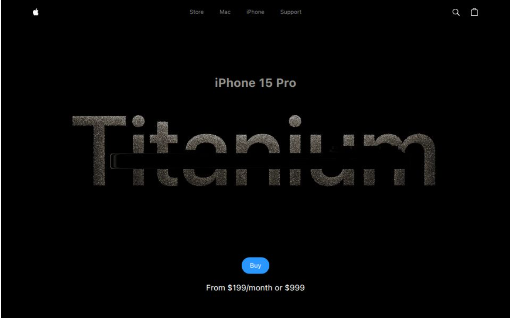

# 🍎 Apple iPhone 15 — Showcase (Clone)

This repository is a clone of the iPhone 15 showcase site, built as an exercise to practice React animations and 3D rendering in the browser.

> Educational/demo project — not affiliated with Apple.

---

## 📺 Preview

Live demo: https://apple-clone-two-ashen.vercel.app/



---

## ✨ Overview

A single-page showcase built with React and Vite. The main goals were to practice animation techniques, multimedia handling (videos/images) and client-side 3D rendering.

Key features:

- GSAP-powered animations and custom helpers
- Video carousel with animated progress indicators
- 3D iPhone model rendering (GLTF) using @react-three/fiber
- Sentry integration for monitoring (demo configuration)

---

## 🧭 Project structure

- `index.html` — main HTML file
- `package.json` — scripts and dependencies
- `vite.config.js` — Vite configuration
- `tailwind.config.js` / `postcss.config.js` — styling configuration
- `public/` — public assets (images, videos, models)
- `src/` — React source code
  - `main.jsx` — app entry (initializes Sentry)
  - `App.jsx` — root component with layout and sections
  - `index.css` — global styles (Tailwind)
  - `components/` — React components (Hero, Model, VideoCarousel, etc.)
  - `utils/` — utilities and animation helpers

---

## 🧰 Technologies

- React 18
- Vite
- Tailwind CSS
- GSAP (animations)
- three.js + @react-three/fiber + @react-three/drei (3D)
- Sentry (monitoring / replay)
- PostCSS / Autoprefixer

---

## 🚀 Getting started

1. Install dependencies:

```bash
npm install
```

2. Run development server:

```bash
npm run dev
```

3. Build for production:

```bash
npm run build
```

4. Preview production build locally:

```bash
npm run preview
```

Scripts are defined in `package.json`.

---

## 🔎 Important notes

- Public assets (images, videos and models) are stored under `public/assets`.
- The main 3D model is located at `public/models/scene.glb`.
- Sentry is initialized in `src/main.jsx`; remove or replace the DSN before using in production.

---

## 🛠️ Development tips

- To tweak animations, check `src/utils/animations.js` and the components inside `src/components/`.
- For 3D canvas work, load GLTF models with `@react-three/drei` (`useGLTF`) and adjust lights/camera in `src/components/Model.jsx`.

---

## 🤝 Contributing

Pull requests are welcome. This repository is intended as a sandbox for experimenting with animations and 3D rendering — open issues to discuss improvements.

---

## 📄 License

Personal / educational use. Add a license if you plan to publish this project publicly.
